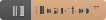

====================
Get Bear-ified! |TM|
====================

.. # https://docutils.sourceforge.io/docs/ref/rst/directives.html#unicode-character-codes
.. |TM| unicode:: U+2122
   :trim:

This provides the |bear-ified| badge (pursuant to `beartype/beartype#44
<https://github.com/beartype/beartype/issues/44>`_). Included is the ``update.bash``
`script <update.bash>`_ in case the image needs to be updated at some unforeseen future
cataclysm. ``update.bash`` was licensed for use in this repository under the `GLWTPL
<https://github.com/me-shaon/GLWTPL/blob/master/LICENSE>`_ and included no warranty
whatsoever.

